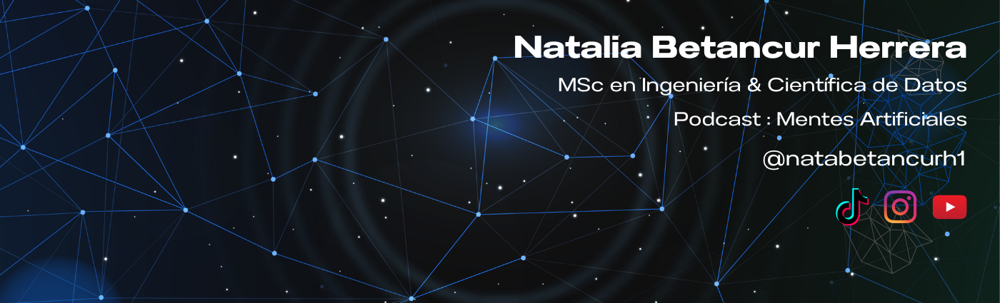

#  Hola, mi nombre es Natalia Betancur 
### Cientifica de Datos | Docente Universitaria

<!--  -->

Científica de datos con más de 5 años de experiencia en el desarrollo de tecnología e Inteligencia Artificial, además docente investigadora, con participación en proyectos financiados por el Ministerio de Ciencia y Tecnología de Colombia. Con formación en Ingeniería Biomédica, Ingeniería Electrónica y Maestría en Ingeniería enfocada en Robótica, certificada como Google Cloud Leader.

He gestionado y liderado de proyectos avanzados de analítica y ciencia de datos en sectores como telecomunicaciones, banca y salud para empresas de Colombia y España. Además, soy creadora de contenido en tecnología, enfocándose en reducir la brecha de conocimiento en inteligencia artificial en América Latina. 

